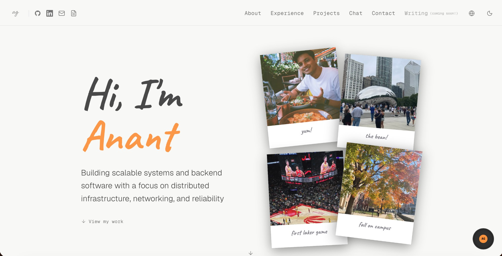

<p align="center">
  My personal portfolio at <a href="https://anantgoyal.com" target="_blank">anantgoyal.com</a>
</p>
<p align="center">
  
</p>

---

## Some Features

- **AI Chatbot** — Ask anything about Anant; powered by Gemini 3.1 Flash Lite
- **Travel Globe** — Interactive 3D globe with polaroid photo modals for each city lived in
- **Music Player** — Floating Spotify-aesthetic record player with a curated track loop
- **Light / Dark mode** — Fully themed via CSS variables; dark = night globe, light = marble globe

---

## Tech Stack

| Layer | Choice |
|---|---|
| Framework | Next.js 16 (App Router) |
| Styling | Tailwind CSS v4 |
| Animations | Framer Motion |
| Icons | Lucide React |
| Fonts | Geist / Geist Mono (next/font) |
| AI | Vercel AI SDK + Google Gemini 3.1 Flash Lite |
| Globe | react-globe.gl |
| Theming | next-themes |
| Deployment | Vercel |

---

## Color Scheme

| Role | Variable | Hex (dark mode) | |
|---|---|---|---|
| Background | `--bg` | `#0a0a0a` |  |
| Primary text | `--fg` | `#e8e8e8` |  |
| Secondary text | `--fg-2` | `#a1a1aa` |  |
| Muted text | `--fg-muted` | `#71717a` |  |
| Dim text | `--fg-dim` | `#52525b` |  |
| Accent (orange) | — | `#FB923C` |  |
| Border | `--border` | `#27272a` |  |
| Nav background | `--nav-bg` | `#0a0a0acc` |  |
| Card / pill bg | `--pill-bg` | `#111111` |  |

---

## Setup

**Prerequisites:** Node.js 18+, a free [Google AI Studio](https://aistudio.google.com/app/apikey) API key.

```bash
# 1. Clone and install
git clone https://github.com/anant248/personal-portfolio.git
cd personal-portfolio
npm install

# 2. Add your Gemini API key
echo "GOOGLE_GENERATIVE_AI_API_KEY=your_key_here" > .env.local

# 3. Start dev server
npm run dev
```

Open [http://localhost:3000](http://localhost:3000).

```bash
# Build for production
npm run build

# Run production build locally
npm start
```

Deploy instantly with [Vercel](https://vercel.com) — add `GOOGLE_GENERATIVE_AI_API_KEY` in your project's Environment Variables settings.
